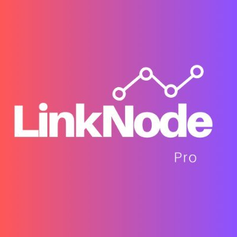

  
    
  

# ⚡ LinkNode Whitepaper

---

## 🌐 Official Links

- 🐦 Twitter: [x.com/LinkNodePro](https://x.com/LinkNodePro)
- 🎥 YouTube: [youtube.com/@LinknodePRO](https://www.youtube.com/@LinknodePRO)
- 🧱 Solana Colosseum: [arena.colosseum.org/profiles/LinkNode](https://arena.colosseum.org/profiles/LinkNode)

---

## 📌 Table of Contents
1. [Overview](#overview)
2. [Core Technology](#core-technology)
3. [How It Works](#how-it-works)
4. [Use Cases](#use-cases)
5. [Token Utility](#token-utility)
6. [Roadmap](#roadmap)
7. [Team](#team)

---

## 🚀 Overview

**LinkNode** is remote desktop access reimagined. Our mission is to bring ultra-fast, secure, and wallet-authenticated desktop sharing to the next generation of decentralized infrastructure.

With just a Solana wallet and a LinkNode client, anyone can instantly connect to another device — no passwords, no emails, no central accounts. Just **Link & Go**.

> Powered by Solana. Backed by code. Controlled by wallets.

LinkNode is designed for developers, creators, support teams, and remote workers who need secure machine access without trusting centralized platforms.

---

## 🔧 Core Technology

LinkNode combines lightweight desktop streaming tech with Solana wallet cryptography to create a **peer-to-peer connection layer** authenticated by your on-chain identity.

### Key Features:
- **Wallet-Based Authentication**  
  Users connect by signing a one-time transaction via Solana wallets (Phantom, Backpack, etc). No passwords or emails.
  
- **Decentralized Node Pairing**  
  Devices find each other using an encrypted signaling layer that relays Solana wallet info. Only the wallet owner can authorize access.

- **On-Chain Session Tokens**  
  Temporary access tokens are minted per session using smart contracts — expiring automatically and revocable mid-session.

- **Blazing Fast Streams**  
  Low-latency screen sharing built in Rust + WebRTC with adaptive bitrate optimization.

---

## 🧠 How It Works

1. **Install the LinkNode client** on any two devices.
2. **Login with your Solana wallet** on both machines — one will be the Host, one the Viewer.
3. The Viewer sends a **wallet-authenticated request** to the Host.
4. Host receives the request, signs it, and a **Solana smart contract** mints a temporary access token valid for that session.
5. A secure P2P stream is established. All data is end-to-end encrypted.

Connections are **wallet-to-wallet**, with no 3rd party storing credentials or routing traffic through centralized servers.

---

## 🔍 Use Cases

- 🧑‍💻 **Remote Work** – Access your workstation securely from anywhere
- 🛠️ **Tech Support** – Help customers without risky screen-share links
- 🧪 **QA / Dev Testing** – Easily remote into test devices across geos
- 🔐 **Self-Custodied Access** – Use your wallet to gate access to your own devices

---

## 💰 Token Utility (Future)

A potential $LINKNODE token will power:
- **Access Credits** – Pay small fees for premium features
- **Node Rewards** – Incentivize hosting encrypted relay nodes
- **Governance** – Vote on feature development, integrations, and fee structures

All features are currently **free during beta**.

---

## 🛣️ Roadmap

| Phase        | Milestone                                           |
|--------------|-----------------------------------------------------|
| Q2 2025      | MVP Launch, GitHub open-source, public beta         |
| Q3 2025      | Mobile clients, referral system, Solana Colosseum   |
| Q4 2025      | Tokenomics reveal, validator incentive rollout      |
| 2026+        | Ecosystem tools, protocol decentralization, DAO     |

---

## 👥 Team

LinkNode is built by a stealth team of Solana-native devs, privacy advocates, and infrastructure nerds. All contributors will be listed after the Colosseum finale.

---

*This document is a living whitepaper and subject to community-driven updates.*
